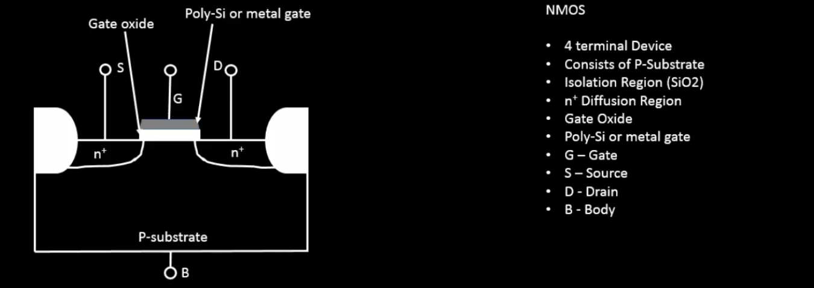
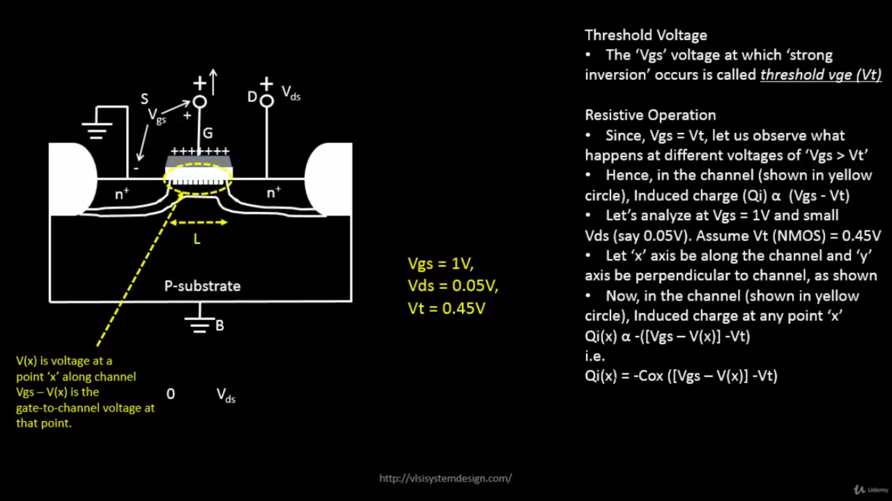
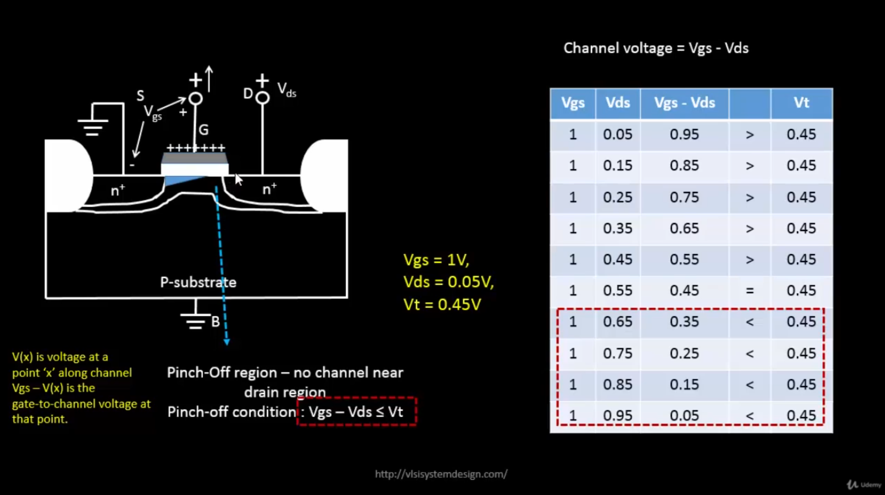
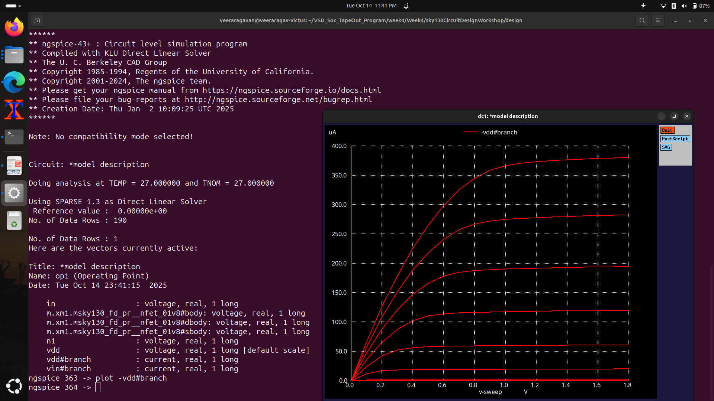

# Basics of NMOS Drain Current (Id) vs Drain-to-Source Voltage (Vds)

## CMOS Circuit Design and SPICE Simulations

### 📚 Contents

1. **Introduction to Circuit Design and SPICE simulations**
    - [Why do we need SPICE simulations?](#why-do-we-need-spice-simulations)
    - [Introduction to Basic Element in Circuit Design - NMOS](#introduction-to-basic-element-in-circuit-design---nmos)
    - [Strong Inversion and Threshold Voltage](#strong-inversion-and-threshold-voltage)
    - [Threshold Voltage with Positive Substrate Potential](#threshold-voltage-with-positive-substrate-potential)

2. **NMOS Resistive Region and Saturation Region of Operation**
    - [Resistive Region of Operation with Small Drain-Source Voltage](#resistive-region-of-operation-with-small-drain-source-voltage)
    - [Drift Current Theory](#drift-current-theory)
    - [Drain Current Model for Linear Region of Operation](#drain-current-model-for-linear-region-of-operation)
    - [SPICE Conclusion to Resistive Operation](#spice-conclusion-to-resistive-operation)
    - [Pinch-Off Region Condition](#pinch-off-region-condition)
    - [Drain Current Model for Saturation Region of Operation](#drain-current-model-for-saturation-region-of-operation)

3. **Introduction to SPICE**
    - [Basic SPICE Setup](#basic-spice-setup)
    - [Circuit Description in SPICE Syntax](#circuit-description-in-spice-syntax)
    - [Define Technology Parameters](#define-technology-parameters)
    - [First SPICE Simulation (LAB)](#first-spice-simulation-lab)

---

### `Why do we need SPICE simulations?`

SPICE (Simulation Program with Integrated Circuit Emphasis) allows designers to test, analyze, and verify circuit behavior **before fabrication**.  
It ensures accuracy, saves cost, and helps in performance optimization.

- **Verification:** Ensures the designed circuit operates as expected.
- **Analysis:** Checks delay, power, and gain characteristics.
- **Optimization:** Helps adjust parameters to meet desired specifications.
- **Visualization:** Generates I-V curves and transient responses to study real behavior.

---

### `Introduction to Basic Element in Circuit Design - NMOS`

An **NMOS transistor** is a fundamental building block in circuit design. It conducts current when a **positive voltage** is applied to the gate relative to the source.  
Its operation depends on the gate-to-source voltage (V<sub>GS</sub>) and drain-to-source voltage (V<sub>DS</sub>).

| Terminal | Symbol | Description |
|-----------|---------|-------------|
| Gate | G | Controls the channel formation |
| Drain | D | Current flows out |
| Source | S | Current enters the transistor |
| Body | B | Connected to substrate or ground |



---

### `Strong Inversion and Threshold Voltage`

When **V<sub>GS</sub>** increases beyond the **threshold voltage (V<sub>t</sub>)**, the NMOS enters **strong inversion**, forming a conductive channel between source and drain.

- **Below Vt:** Transistor is OFF (no channel).
- **At Vt:** Inversion layer starts forming.
- **Above Vt:** Channel is strongly inverted and current flows.

The threshold voltage determines the **minimum V<sub>GS</sub>** required for conduction.

---

### `Threshold Voltage with Positive Substrate Potential`

Applying a **positive body-to-source voltage (V<sub>SB</sub>)** increases the **threshold voltage (V<sub>t</sub>)** — this is the **Body Effect**.

The threshold voltage under substrate bias is:

<p align="center">
  
</p>

Where:
- **γ** = Body Effect Coefficient  
- **Φ<sub>f</sub>** = Fermi Potential  

This effect reduces drain current for the same gate voltage since a higher V<sub>GS</sub> is required to turn ON the device.

---

### `Resistive Region of Operation with Small Drain-Source Voltage`

In this region (**V<sub>GS</sub> > V<sub>t</sub>**, small **V<sub>DS</sub>**):

- The channel is formed, allowing current flow from source to drain.
- The transistor acts like a **voltage-controlled resistor**.
- Current (I<sub>D</sub>) increases linearly with V<sub>DS</sub>.


Mathematically:
> I<sub>D</sub> = μ<sub>n</sub> C<sub>ox</sub> (W/L) [(V<sub>GS</sub> - V<sub>t</sub>)V<sub>DS</sub> - (V<sub>DS</sub>² / 2)]

---

### `Drift Current Theory`

In NMOS operation, the **drift current** dominates:

- Electrons move under the influence of an electric field due to V<sub>DS</sub>.
- The induced charge in the channel is:
  
  Q<sub>i</sub>(x) = -C<sub>ox</sub> × [(V<sub>GS</sub> - V(x)) - V<sub>t</sub>]

- The **drain current** is:

  I<sub>D</sub> = μ<sub>n</sub> × (W/L) × C<sub>ox</sub> × [(V<sub>GS</sub> - V<sub>t</sub>)V<sub>DS</sub> - (V<sub>DS</sub>²/2)]

This represents **linear region conduction**, where current rises proportionally with V<sub>DS</sub>.

---

### `Drain Current Model for Linear Region of Operation`

From drift current equations, the drain current (I<sub>D</sub>) in the **linear region** is derived as:

<p align="center">
  
</p>

This relation remains valid until **V<sub>DS</sub> = V<sub>GS</sub> - V<sub>t</sub>** (the pinch-off point).

---

### `SPICE Conclusion to Resistive Operation`

SPICE simulations confirm linear behavior of I<sub>D</sub> with V<sub>DS</sub> for small drain voltages.  
By sweeping **V<sub>DS</sub>** for various **V<sub>GS</sub>**, we obtain **I<sub>D</sub>-V<sub>DS</sub>** curves as shown below:



This verifies the theoretical linear model of NMOS in resistive operation.

---

### `Pinch-Off Region Condition`

When **V<sub>DS</sub> ≥ V<sub>GS</sub> - V<sub>t</sub>**, the channel near the drain is depleted — known as **pinch-off**.  
Beyond this point, the drain current becomes **independent of V<sub>DS</sub>**, entering **saturation**.



---

### `Drain Current Model for Saturation Region of Operation`

At pinch-off, the drain current saturates and follows the quadratic model:

<p align="center">
  
</p>

> I<sub>D</sub> = (1/2) μ<sub>n</sub> C<sub>ox</sub> (W/L) (V<sub>GS</sub> - V<sub>t</sub>)²

With **channel length modulation**, current slightly increases with V<sub>DS</sub>:

> I<sub>D</sub> = (1/2) μ<sub>n</sub> C<sub>ox</sub> (W/L) (V<sub>GS</sub> - V<sub>t</sub>)² (1 + λV<sub>DS</sub>)

---

### `Basic SPICE Setup`

SPICE is used to simulate NMOS device characteristics.  
A basic SPICE setup includes:

- **Defining model parameters**
- **Netlist with transistor connections**
- **Voltage sources (V<sub>GS</sub>, V<sub>DS</sub>)**
- **Simulation commands (.op, .dc)**

Example netlist structure:

```
spice

M1 vdd n1 0 0 nmos W=5u L=2u
Vdd vdd 0 1.8
Vin n1 0 1.8
.lib "sky130_fd_pr/models/sky130.lib.spice" tt
.op
.dc Vdd 0 1.8 0.1 Vin 0 1.8 0.2
.end
```

---

### `Circuit Description in SPICE Syntax`

| SPICE Line | Description |
|-------------|--------------|
| `M1 vdd n1 0 0 nmos W=5u L=2u` | NMOS transistor (Drain, Gate, Source, Bulk) |
| `Vdd vdd 0 1.8` | Drain voltage source |
| `Vin n1 0 1.8` | Gate voltage source |
| `.lib` | Includes process technology model |
| `.dc` | Performs DC sweep for V<sub>DS</sub> and V<sub>GS</sub> |

---

### `Define Technology Parameters`

In SPICE, **technology model files** define device behavior (mobility, oxide thickness, Vt, etc.).  
For example, the SkyWater **sky130** process uses: .lib "sky130_fd_pr/models/sky130.lib.spice" tt


This line includes the transistor model at **typical process corner (tt)** for accurate simulation.

---

### `First SPICE Simulation (LAB)`

To run the simulation:

```bash
ngspice nmos_idvds.spice
plot -vdd#branch
```
This generates Id vs Vds curves for multiple Vgs values.




### ✅ Conclusion:
The SPICE simulation validates NMOS theoretical operation:

- Linear increase of I<sub>D</sub> with V<sub>DS</sub> in resistive region.
- Saturation current stabilization after pinch-off.
