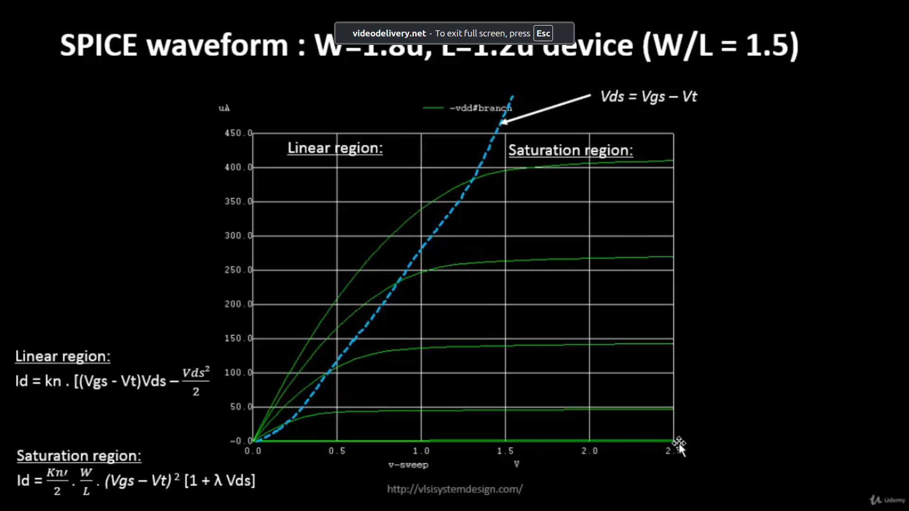
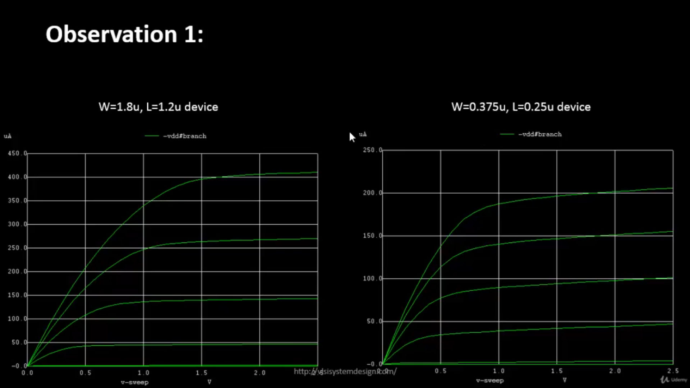
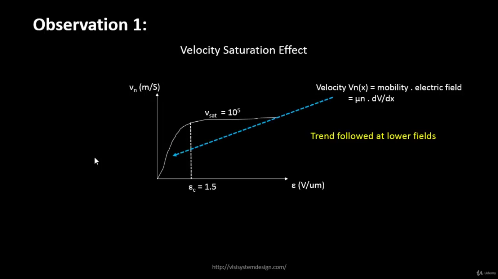
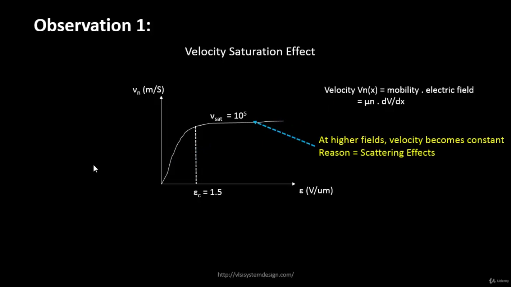
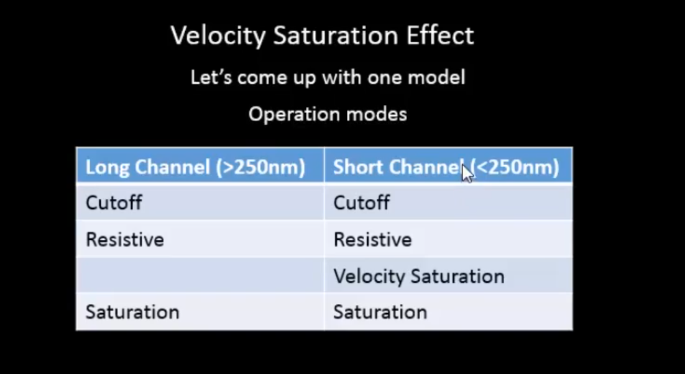
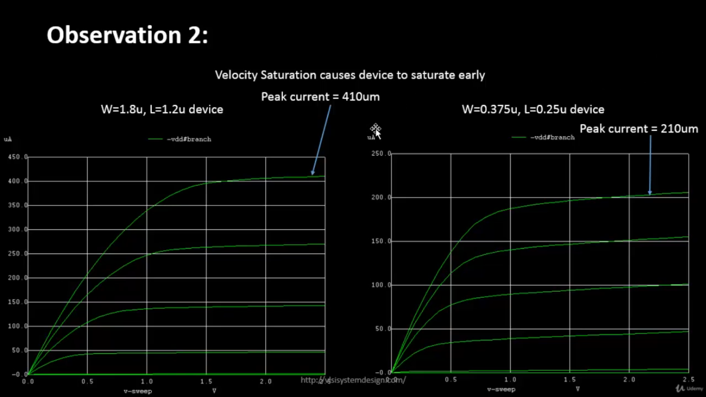
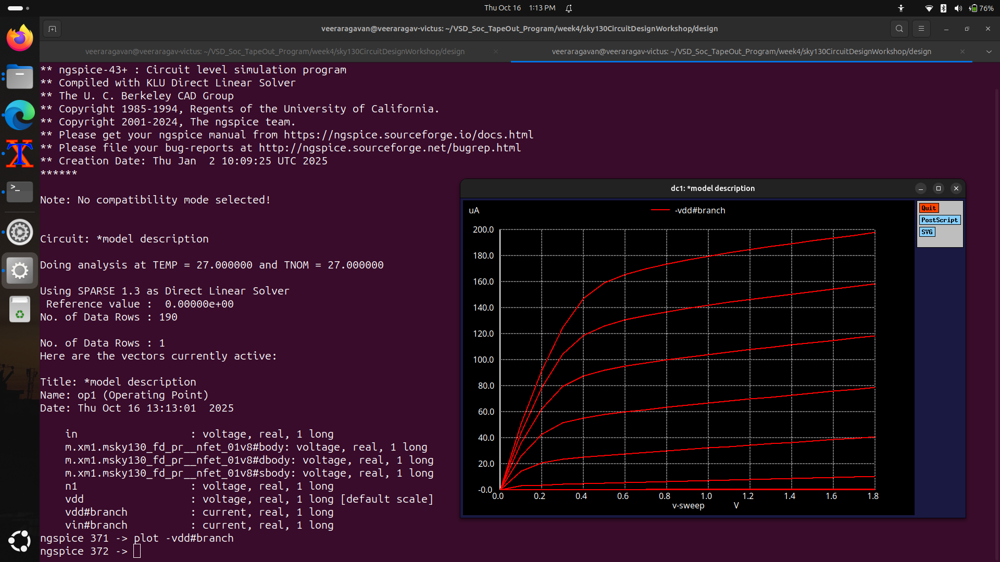
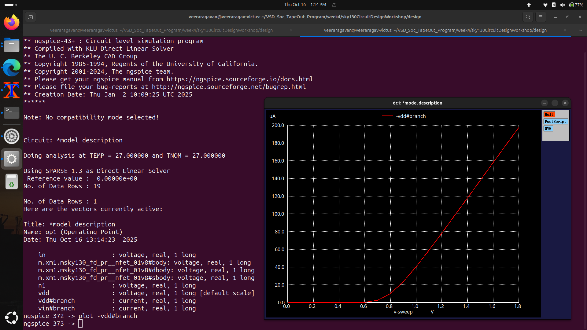

# VSD Hardware Design Program

## Velocity Saturation and Basics of CMOS Inverter VTC

### 📚 Contents

- [SPICE Simulation for Lower Nodes and Velocity Saturation Effect](#spice-simulation-for-lower-nodes-and-velocity-saturation-effect)  
  - [SPICE Simulation for Lower Nodes](#spice-simulation-for-lower-nodes)  
  - [Drain Current vs Gate Voltage for Long and Short Channel Devices](#drain-current-vs-gate-voltage-for-long-and-short-channel-devices)  
  - [Velocity Saturation at Lower and Higher Electric Fields](#velocity-saturation-at-lower-and-higher-electric-fields)  
  - [Velocity Saturation Drain Current Model](#velocity-saturation-drain-current-model)  
  - [Lab: Id vs Vgs](#lab-id-vs-vgs)  
  - [Lab: Threshold Voltage (Vt)](#lab-threshold-voltage-vt)
- [CMOS Voltage Transfer Characteristic (VTC)](#cmos-voltage-transfer-characteristic-vtc)  
  - [MOSFET as a Switch](#mosfet-as-a-switch)  
  - [Introduction to Standard MOS Voltage-Current Parameters](#introduction-to-standard-mos-voltage-current-parameters)  
  - [PMOS/NMOS Drain Current vs Drain Voltage](#pmosnmos-drain-current-vs-drain-voltage)  
  - [Convert PMOS Gate-Source Voltage to Vin](#convert-pmos-gate-source-voltage-to-vin)  
  - [Convert PMOS and NMOS Drain-Source Voltage to Vout](#convert-pmos-and-nmos-drain-source-voltage-to-vout)  
  - [Merge PMOS-NMOS Load Curves and Plot VTC](#merge-pmos-nmos-load-curves-and-plot-vtc)

---

## SPICE Simulation for Lower Nodes and Velocity Saturation Effect

### SPICE Simulation for Lower Nodes

The output characteristics of an NMOS device with W=1.8μm, L=1.2μm (W/L = 1.5) are shown below:



**Linear Region:**  
- Drain current (Id) is proportional to Vds when Vds < (Vgs - Vt).  

**Saturation Region:**  
- Id is influenced by channel length modulation and is nearly constant when Vds ≥ (Vgs - Vt).

---

### Drain Current vs Gate Voltage for Long and Short Channel Devices

The plot below compares long-channel and short-channel NMOS devices with the same W/L ratio:



- **Long Channel Device:** W = 1.8μm, L = 1.2μm  
- **Short Channel Device:** W = 0.375μm, L = 0.25μm  

> **Observation:**  
> - Long-channel Id ∝ Vgs² (ideal quadratic)  
> - Short-channel Id shows quadratic at low Vgs but becomes linear at higher Vgs due to **velocity saturation**.

  
---

### Velocity Saturation at Lower and Higher Electric Fields

- **Low Electric Fields:** Carrier velocity increases linearly with the field.  
- **High Electric Fields:** Carrier velocity saturates → Id flattens.  

  


**Mode Summary:**

- **Long Channel (>250nm):** Cutoff → Resistive → Saturation  
- **Short Channel (<250nm):** Cutoff → Resistive → **Velocity Saturation** → Saturation  



---

### Velocity Saturation Drain Current Model

The drain current in the velocity saturation region can be approximated as:

\[
I_d = I_{dsat} \left(1 + \lambda V_{ds}\right)
\]

Where:  
- \(I_{dsat}\) = Saturation current limited by carrier velocity  
- \(\lambda\) = Channel length modulation factor  


#### Peak Current Comparison — Long Channel vs Short Channel Devices

The figure below compares the **peak drain current (Id)** between a long-channel and short-channel NMOS device:



**Left Plot**: W = 1.8μm, L = 1.2μm → **Long-channel device**
  - Peak current = **410 μA**
  
**Right Plot**: W = 0.375μm, L = 0.25μm → **Short-channel device**
  - Peak current = **210 μA**

Even though **short-channel devices** allow for faster switching and smaller sizes, their **peak drain current (Id)** is lower than long-channel devices.

The reduction in peak current is due to **velocity saturation** — which limits carrier velocity in short-channel devices.

In long-channel devices, carriers accelerate freely, giving higher Id.


---

### Lab: Id vs Vgs

<details> <summary><strong>day2_nfet_idvds_L015_W039.spice</strong></summary>

The plot of Ids vs Vds over constant Vgs:

```
spice

*Model Description
.param temp=27

*Including sky130 library files
.lib "sky130_fd_pr/models/sky130.lib.spice" tt

*Netlist Description

XM1 Vdd n1 0 0 sky130_fd_pr__nfet_01v8 w=0.39 l=0.15

R1 n1 in 55

Vdd vdd 0 1.8V
Vin in 0 1.8V

*simulation commands
.op
.dc Vdd 0 1.8 0.1 Vin 0 1.8 0.2
.control
run
display
setplot dc1
.endc
.end
```


</details>

<details> <summary><strong>day2_nfet_idvgs_L015_W039.spice</strong></summary>

The plot of Ids vs Vgs over constant Vds:

```spice
*Model Description
.param temp=27

*Including sky130 library files
.lib "sky130_fd_pr/models/sky130.lib.spice" tt

*Netlist Description
XM1 Vdd n1 0 0 sky130_fd_pr__nfet_01v8 w=0.39 l=0.15
R1 n1 in 55
Vdd vdd 0 1.8V
Vin in 0 1.8V

*simulation commands
.op
.dc Vin 0 1.8 0.1 

.control
run
display
setplot dc1
.endc
.end
```


</details>
