# VSD Hardware Design Program

## CMOS Switching Threshold and Dynamic Simulations

### 📚 Contents

- [Voltage Transfer Characteristics — SPICE Simulations](#voltage-transfer-characteristics--spice-simulations)
  - [SPICE Deck Creation for CMOS Inverter](#spice-deck-creation-for-cmos-inverter)
  - [SPICE Simulation for CMOS Inverter](#spice-simulation-for-cmos-inverter)
  - [Labs: Sky130 SPICE Simulation for CMOS](#labs-sky130-spice-simulation-for-cmos)
- [Static Behavior Evaluation — CMOS Inverter Robustness — Switching Threshold](#static-behavior-evaluation--cmos-inverter-robustness--switching-threshold)
  - [Switching Threshold (Vm)](#switching-threshold-vm)
  - [Analytical Expression of Vm as a Function of (W/L)p and (W/L)n](#analytical-expression-of-vm-as-a-function-of-wlp-and-wln)
  - [Analytical Expression of (W/L)p and (W/L)n as a Function of Vm](#analytical-expression-of-wlp-and-wln-as-a-function-of-vm)
  - [Static and Dynamic Simulation of CMOS Inverter](#static-and-dynamic-simulation-of-cmos-inverter)
  - [Static and Dynamic Simulation with Increased PMOS Width](#static-and-dynamic-simulation-with-increased-pmos-width)
  - [Application of CMOS Inverter in Clock Network and STA](#application-of-cmos-inverter-in-clock-network-and-sta)

---

### `Voltage Transfer Characteristics — SPICE Simulations`

#### SPICE Deck Creation for CMOS Inverter

This section demonstrates how to construct a **SPICE deck** for a CMOS inverter using the Sky130 PDK.

- **Transistor Connectivity:** Define PMOS (M1) and NMOS (M2) connections with `Vdd`, `Vin`, `Vout`, and ground.
- **Parameter Definition:** Specify transistor dimensions, supply voltage (1.8 V), and load capacitance.
- **Node Naming:** Assign unique node names (`in`, `out`, `vdd`, `vss`) to simplify simulation tracking.
- **Model Inclusion:** Include Sky130 model files to ensure realistic simulation behavior.

This setup forms the foundation for accurate **CMOS inverter simulations**.

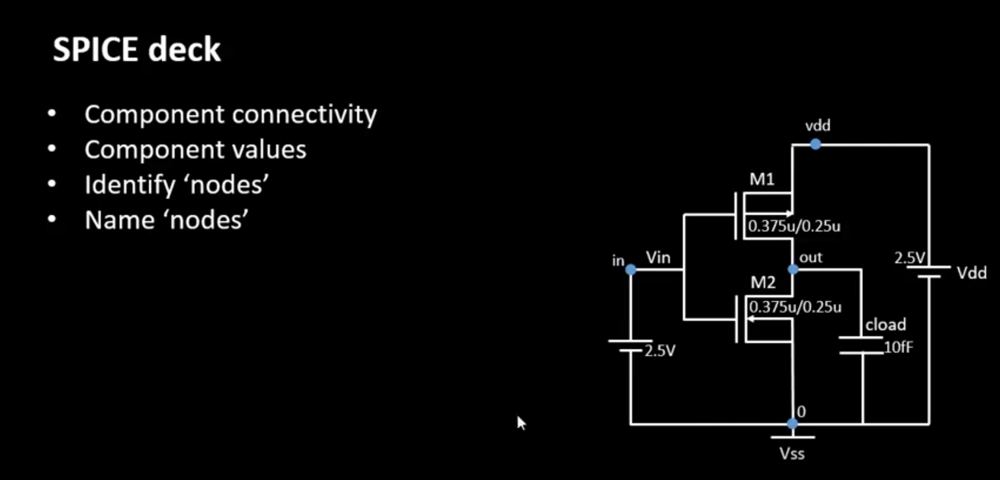

---

#### SPICE Simulation for CMOS Inverter

Once the SPICE deck is prepared, DC and transient simulations are performed.

- **DC Sweep (`.dc`)** — Used to obtain **Voltage Transfer Characteristics (VTC)** by sweeping `Vin` from 0 V → 1.8 V.
- **Transient (`.tran`)** — Used to observe **dynamic behavior** such as rise and fall delays.

Simulation parameters include:
- `Vdd = 1.8 V`
- `Cload = 50 fF`
- Transistor dimensions: `Wp = 0.84 µm`, `Wn = 0.36 µm`, `L = 0.15 µm`

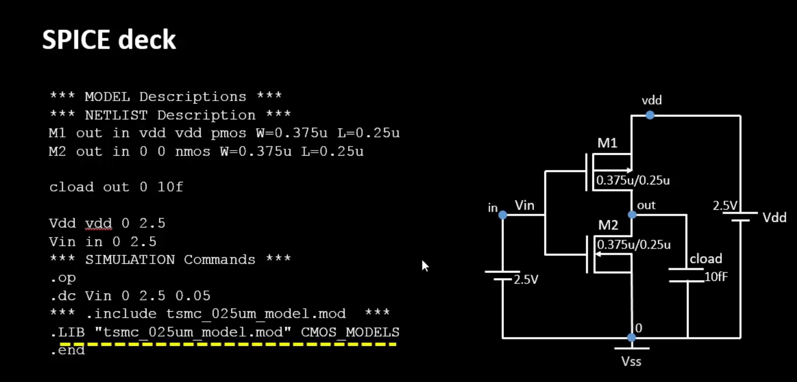

---

### `Labs: Sky130 SPICE Simulation for CMOS`

<summary><strong>day4_inv_vtc_Wp084_Wn036.spice</strong></summary>

```spice
*Model Description
.param temp=27

*Including sky130 library files
.lib "sky130_fd_pr/models/sky130.lib.spice" tt

*Netlist Description
XM1 out in vdd vdd sky130_fd_pr__pfet_01v8 w=0.84 l=0.15
XM2 out in 0 0 sky130_fd_pr__nfet_01v8 w=0.36 l=0.15

Cload out 0 50fF
Vdd vdd 0 1.8V
Vin in 0 1.8V

*Simulation commands
.op
.dc Vin 0 1.8 0.01

.control
run
setplot dc1
display
.endc
.end
```


📈 **Plot the waveforms in ngspice**

```shell
ngspice day4_inv_vtc_Wp084_Wn036.spice
plot out vs in
```
The resulting plot represents the Voltage Transfer Characteristic (VTC) of the CMOS inverter.

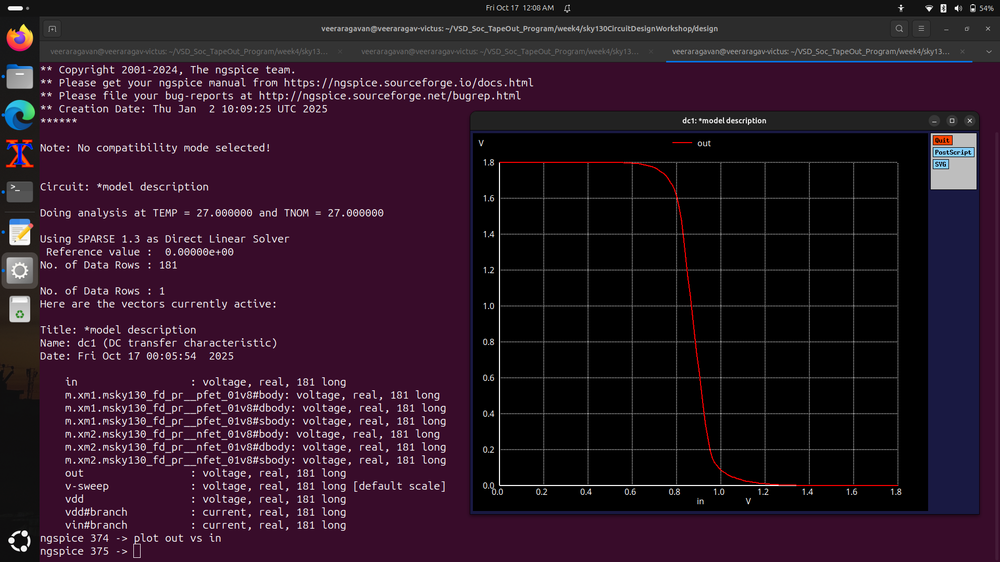


<summary><strong>day4_inv_tran_Wp084_Wn036.spice</strong></summary>

```spice
*Model Description
.param temp=27

*Including sky130 library files
.lib "sky130_fd_pr/models/sky130.lib.spice" tt

*Netlist Description
XM1 out in vdd vdd sky130_fd_pr__pfet_01v8 w=0.84 l=0.15
XM2 out in 0 0 sky130_fd_pr__nfet_01v8 w=0.36 l=0.15

Cload out 0 50fF

Vdd vdd 0 1.8V
Vin in 0 PULSE(0V 1.8V 0 0.1ns 0.1ns 2ns 4ns)

*Simulation commands
.tran 1n 10n

.control
run
.endc
.end
```
📈  **Plot the waveforms in ngspice**

```shell
ngspice day4_inv_tran_Wp084_Wn036.spice
plot out vs time in
```

This transient simulation provides rise and fall delay information of the CMOS inverter.

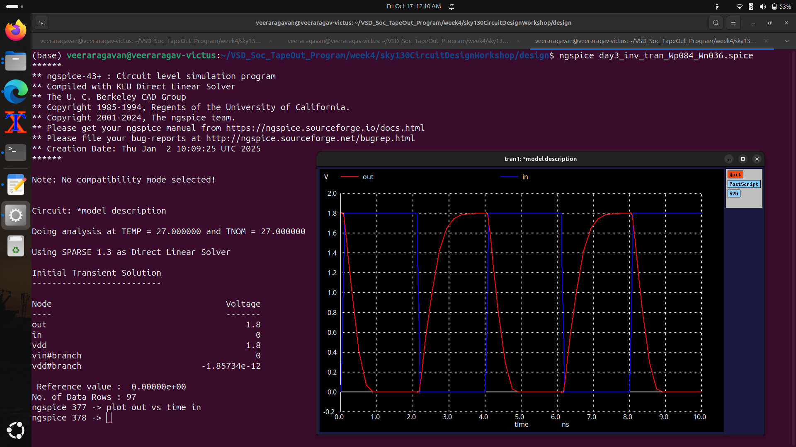

## Static Behavior Evaluation — CMOS Inverter Robustness — Switching Threshold

### Switching Threshold (Vm)

- The Switching Threshold Voltage (Vm) is the point where Vin = Vout.
- At Vm, both NMOS and PMOS operate in saturation, contributing equally to current flow.
- This determines noise margins and overall inverter robustness.

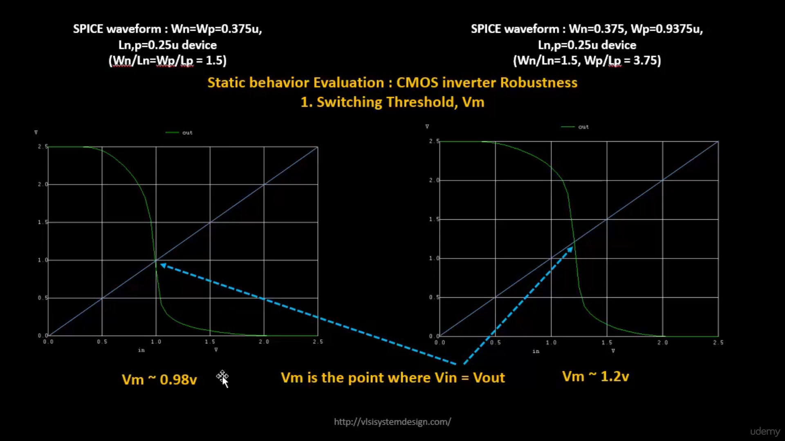


### Analytical Expression of Vm as a Function of (W/L)p and (W/L)n

- At the switching threshold, current balance condition holds:

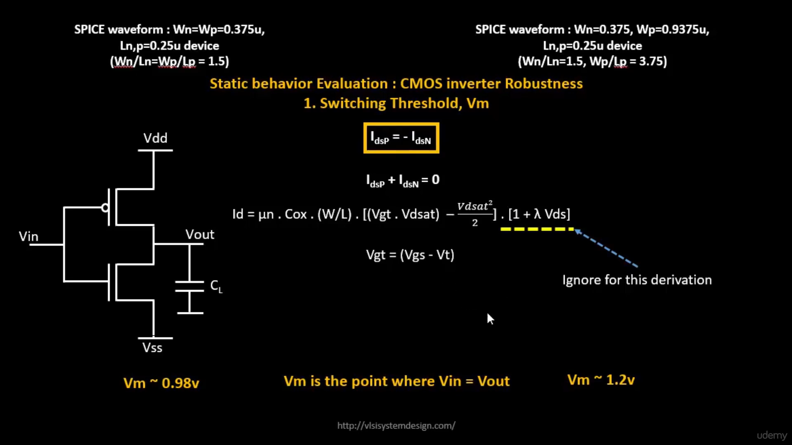
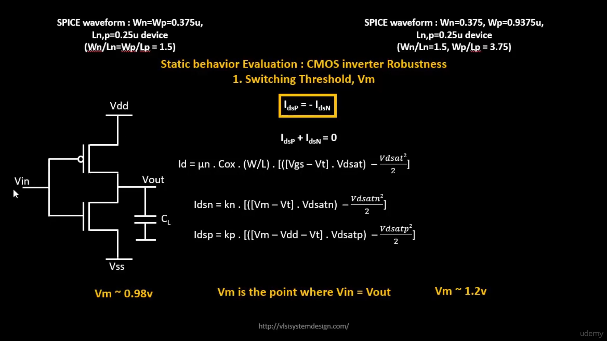
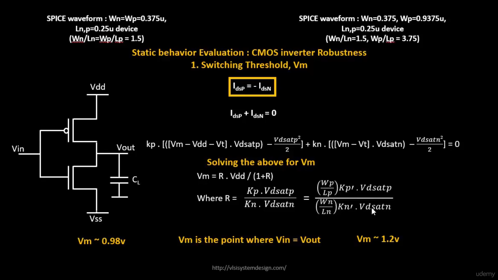

This expression relates Vm to device parameters and mobility ratios.

### Analytical Expression of (W/L)p and (W/L)n as a Function of Vm

- From the same condition, the required sizing ratio can be derived:

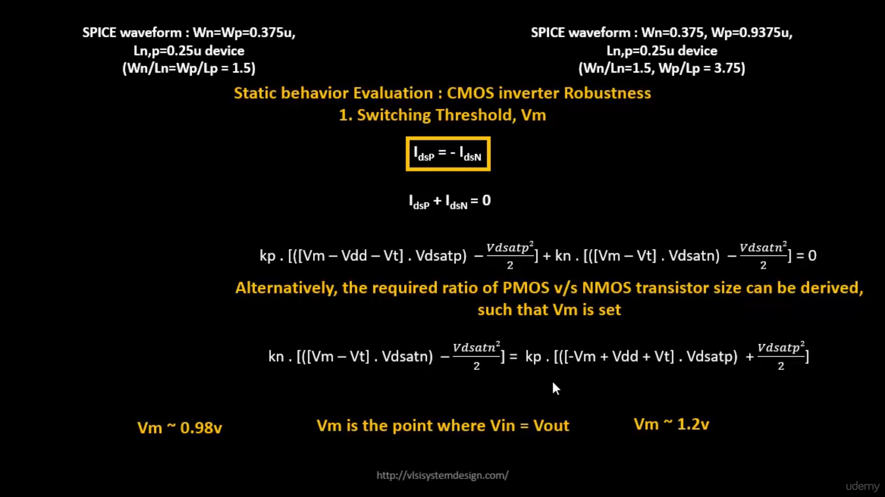
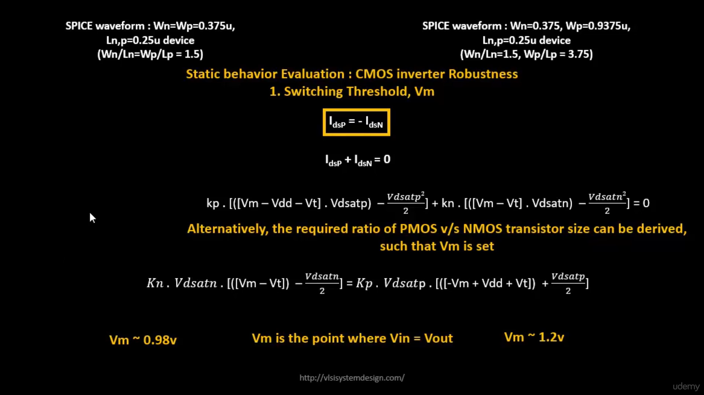
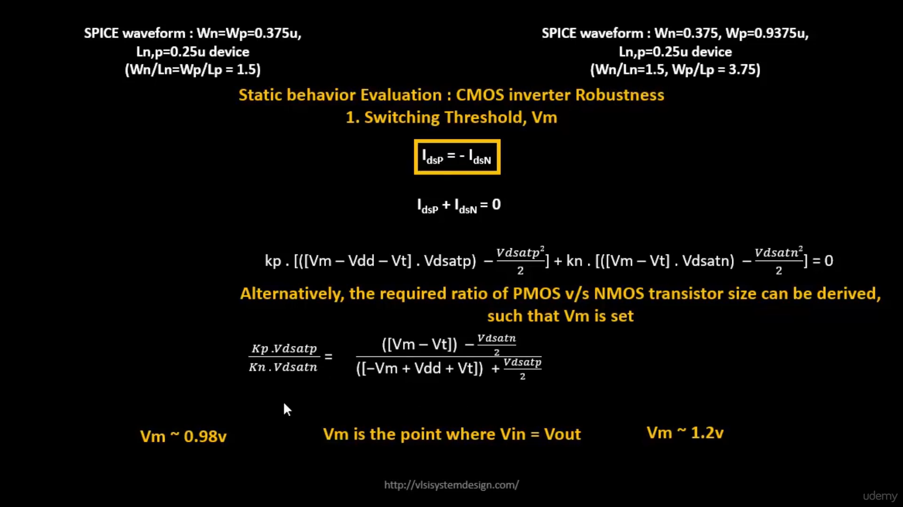
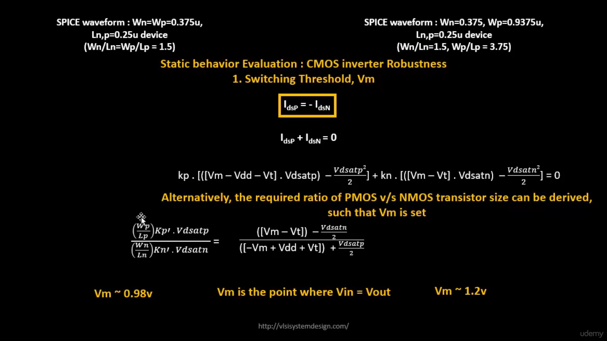
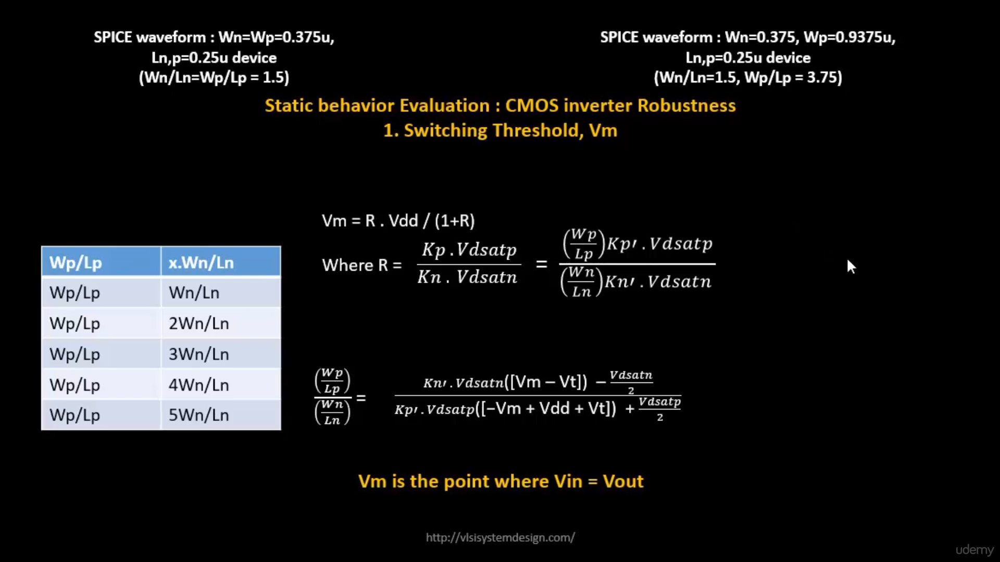

This equation helps determine the optimal PMOS/NMOS width ratio for a desired Vm.

### Static and Dynamic Simulation of CMOS Inverter

By running both .dc (static) and .tran (dynamic) simulations:
- Static analysis shows VTC and switching threshold.
- Dynamic analysis provides rise/fall times, propagation delays, and signal integrity data.

### Static and Dynamic Simulation with Increased PMOS Width

When PMOS width is increased:
- Rise delay decreases due to higher pull-up strength.
- Switching threshold (Vm) shifts toward higher voltage.
- Achieves balanced rise/fall delays improving clock signal symmetry.

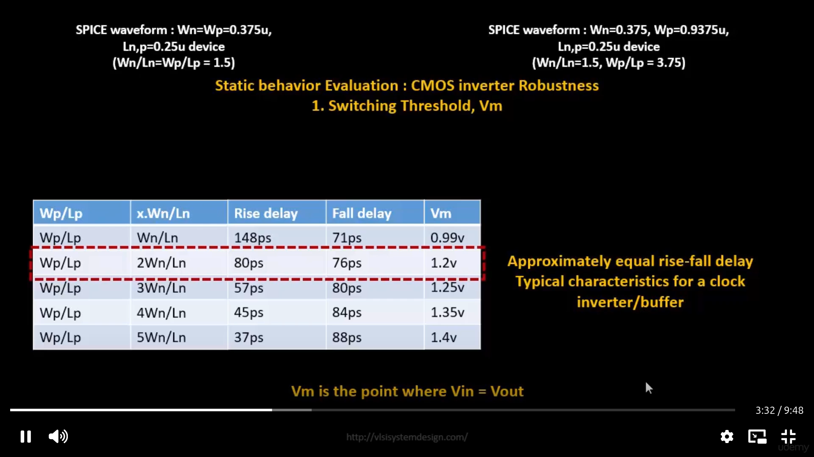

### Application of CMOS Inverter in Clock Network and STA:
- Inverters are widely used as clock buffers in digital ICs.
- Balanced rise and fall delays ensure duty cycle accuracy and timing closure in Static Timing Analysis (STA).
- Mismatch in PMOS/NMOS drive strengths can cause duty cycle distortion, which can be corrected through buffer sizing and STA optimization.

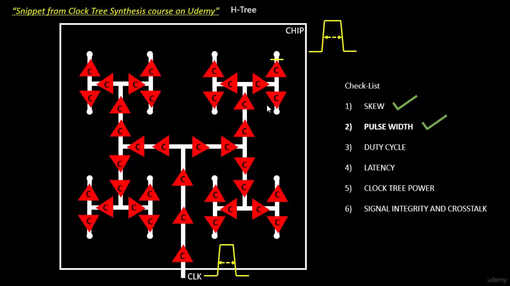

### ✅ Conclusion

Through detailed SPICE simulations and theoretical analysis:
- Switching Threshold Voltage (Vm) defines inverter stability and noise margins.
- Proper sizing of PMOS/NMOS transistors balances rise/fall delays.
- Velocity saturation and channel length effects impact device drive current and switching efficiency.
- In clock networks, optimized inverters ensure timing accuracy and low power operation.
- The CMOS inverter thus serves as the fundamental building block for high-performance, power-efficient digital circuits in modern VLSI design.
