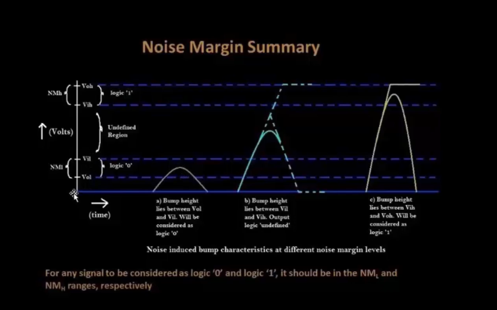

# VSD Hardware Design Program

## CMOS Noise Margin Robustness Evaluation

### 📚 Contents

- [Static Behavior Evaluation — CMOS Inverter Robustness — Noise Margin](#static-behavior-evaluation--cmos-inverter-robustness--noise-margin)
  - [Introduction to Noise Margin](#introduction-to-noise-margin)
  - [Noise Margin Voltage Parameters](#noise-margin-voltage-parameters)
  - [Noise Margin Equation and Summary](#noise-margin-equation-and-summary)
  - [Noise Margin Variation with Respect to PMOS Width](#noise-margin-variation-with-respect-to-pmos-width)
  - [Sky130 Noise Margin Labs](#sky130-noise-margin-labs)

---

### `Static Behavior Evaluation — CMOS Inverter Robustness — Noise Margin`

---

### `Introduction to Noise Margin`

**Noise Margin** is the maximum unwanted voltage or signal noise that a CMOS logic circuit can tolerate at its input without causing a wrong output logic level.

- It ensures **reliable switching** in the presence of disturbances or voltage fluctuations.  
- A higher noise margin indicates a **more robust CMOS design**.  
- The **Voltage Transfer Characteristic (VTC)** curve of a CMOS inverter helps visualize the **noise margins** and the **undefined region**.


In the figure above:
- The **ideal inverter** has an abrupt transition at `Vdd/2`.  
- The **practical inverter** has a finite slope, creating an undefined region between the two logic thresholds.

---

### `Noise Margin Voltage Parameters`

From the VTC curve, four voltage levels define the CMOS inverter’s noise behavior:

- **VOH** — Valid logic high output voltage  
- **VOL** — Valid logic low output voltage  
- **VIH** — Input high threshold voltage (slope = −1 on right side of VTC)  
- **VIL** — Input low threshold voltage (slope = −1 on left side of VTC)


---

### `Noise Margin Equation and Summary`

✅ **Equations:**

- **Noise Margin High (NMH):**  
  `NMH = VOH − VIH`  
  → Maximum noise voltage that can be superimposed on a logic ‘1’ without flipping the output.

- **Noise Margin Low (NML):**  
  `NML = VIL − VOL`  
  → Maximum noise voltage that can be superimposed on a logic ‘0’ without flipping the output.

✅ **Key Observations:**

- Larger **NMH** and **NML** values indicate better **noise immunity**.  
- Designers aim for **balanced NMH and NML** for symmetric robustness.  
- The undefined region lies between `VIL` and `VIH`, where input levels cannot be reliably interpreted.  



> ⚙️ **Summary:**  
> - Noise Margin helps CMOS circuits reject spurious input noise or “bumps.”  
> - Input noise within NMH/NML limits does **not affect** the logical output.  
> - Noise within the undefined region causes **unstable or unpredictable outputs**.

---

### `Noise Margin Variation with Respect to PMOS Width`

By changing the **PMOS width (Wp)** while keeping the NMOS width (Wn) constant:

- **Increasing Wp** → strengthens the PMOS, shifting the VTC curve **toward the right**.  
- This causes **VOH** to remain nearly constant, while **VIL** and **VIH** slightly shift.  
- The **Noise Margin (NMH/NML)** changes accordingly — generally improving for balanced inverter sizing.

| PMOS Width (Wp) | Wn (constant) | NMH (V) | NML (V) | Observation |
|-----------------|---------------|----------|----------|--------------|
| 0.84 µm         | 0.36 µm       | 0.52     | 0.48     | Balanced noise margins |
| 1.00 µm         | 0.36 µm       | 0.55     | 0.45     | Slight shift in VTC midpoint |
| 1.20 µm         | 0.36 µm       | 0.60     | 0.40     | Right shift, improved NMH |

> 📈 Wider PMOS increases NMH but may reduce NML slightly — a design trade-off in noise robustness and switching balance.

---

### `Sky130 Noise Margin Labs`

<summary><strong>day4_inv_noisemargin_wp1_wn036.spice</strong></summary>


```
*Model Description
.param temp=27

*Including Sky130 library files
.lib "sky130_fd_pr/models/sky130.lib.spice" tt

*Netlist Description

XM1 out in vdd vdd sky130_fd_pr__pfet_01v8 w=1 l=0.15
XM2 out in 0 0 sky130_fd_pr__nfet_01v8 w=0.36 l=0.15

Cload out 0 50fF

Vdd vdd 0 1.8V
Vin in 0 1.8V

*Simulation Commands
.op
.dc Vin 0 1.8 0.01

.control
run
setplot dc1
display
.endc

.end
```

#### 📈 **Run the Simulation in ngspice**

```shell
ngspice day4_inv_noisemargin_wp1_wn036.spice
plot out vs in
```
Below image shows the Voltage Transfer Characteristic (VTC) curve used to extract Noise Margins:


### 🧠 How to Calculate Noise Margin from SPICE Plot

1️⃣ Click on PMOS slope (left edge) — gives: x0 = VIL, y0 = VOH
2️⃣ Click on NMOS slope (right edge) — gives: x1 = VIH, y1 = VOL

Then compute:

#### NMH = VOH − VIH = y0 − x1
#### NML = VIL − VOL = x0 − y1

✅ Balanced NMH and NML values indicate a robust CMOS inverter with good noise tolerance.

### 🧩 Conclusion

- Noise margin defines the robustness of CMOS logic gates against voltage disturbances.
- The VTC curve helps determine valid input and output regions.
- Balanced transistor sizing ensures symmetrical NMH/NML, improving circuit stability.
- Practical SPICE simulations using Sky130 PDK confirm theoretical behavior, validating the design for low-power and noise-tolerant digital systems.
