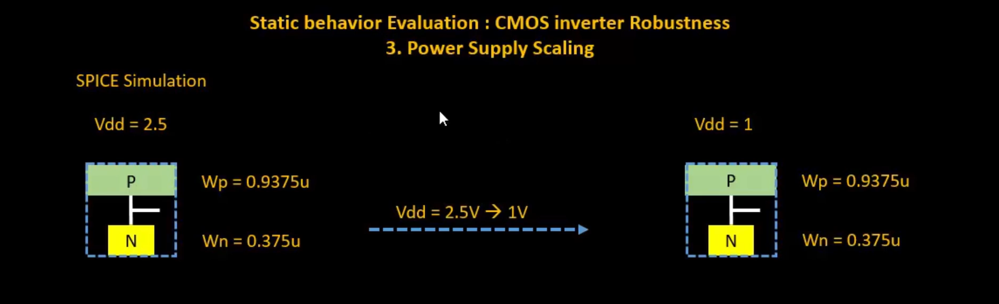
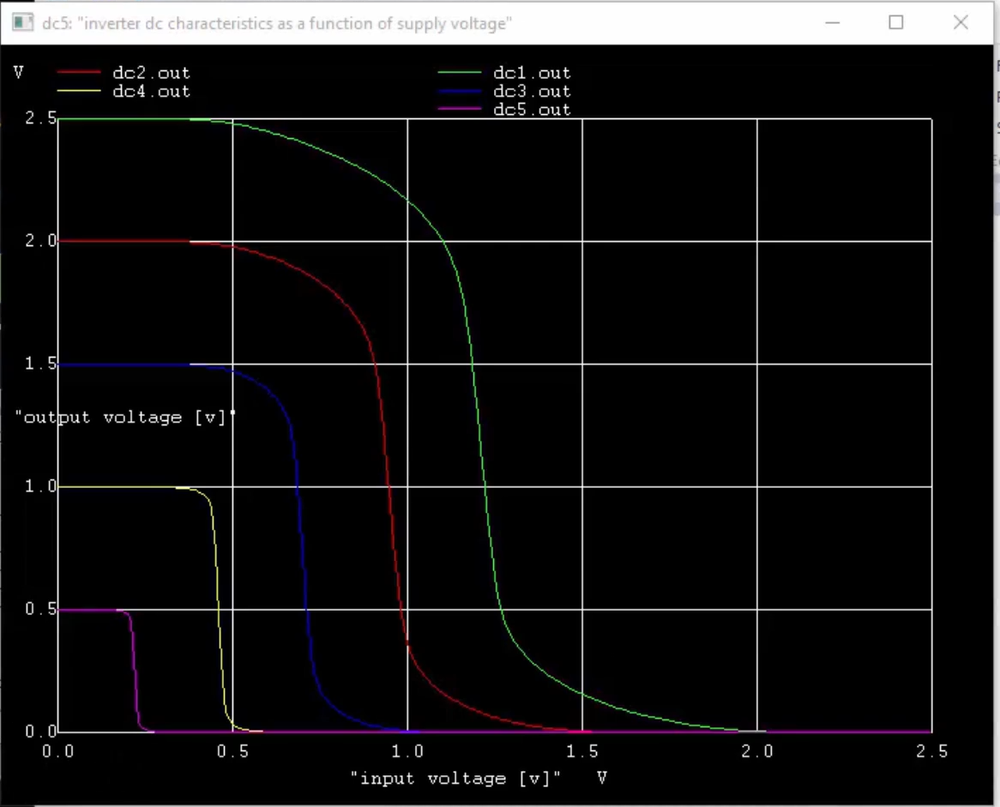
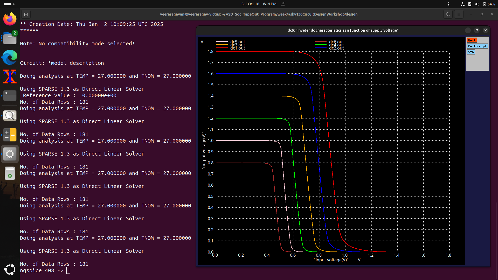
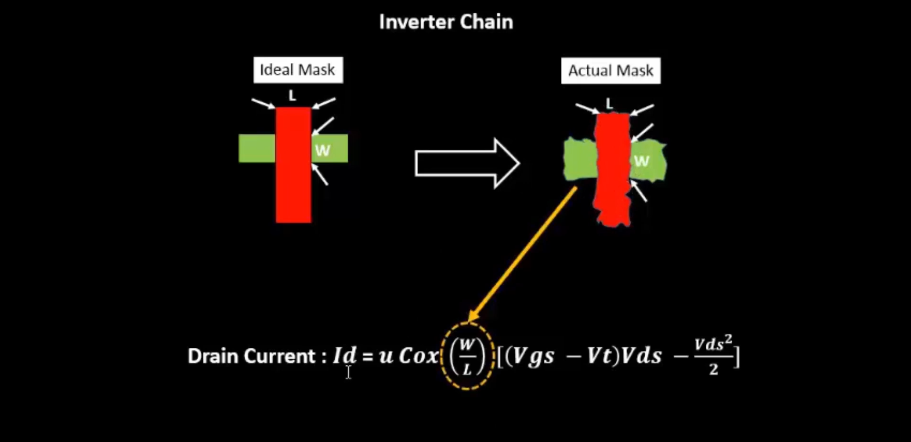
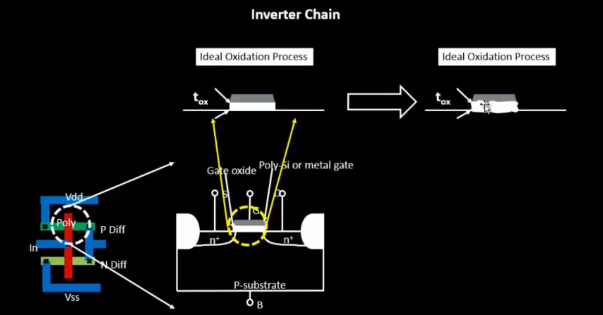
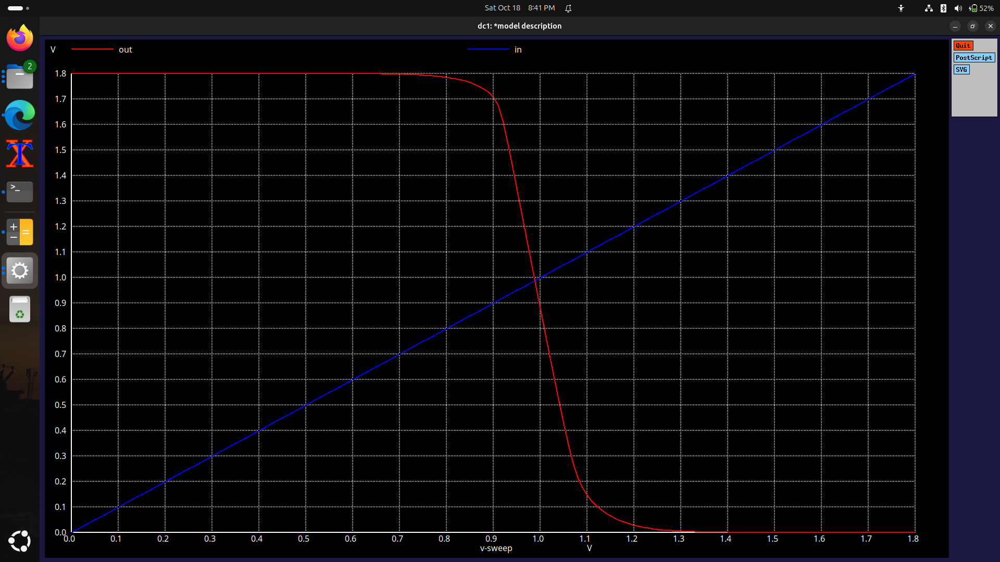
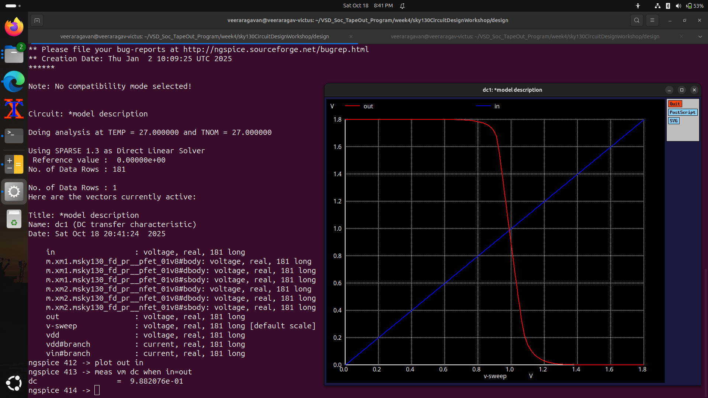

# VSD Hardware Design Program

## CMOS Power Supply and Device Variation Robustness Evaluation

### 📚 Contents

- [Static Behavior Evaluation — CMOS Inverter Robustness — Power Supply Variation](#static-behavior-evaluation--cmos-inverter-robustness--power-supply-variation)
  - [Smart SPICE Simulation for Power Supply Variation](#smart-spice-simulation-for-power-supply-variation)
  - [Advantages and Disadvantages of Using Low Supply Voltage](#advantages-and-disadvantages-of-using-low-supply-voltage)
  - [Sky130 Supply Variation Labs](#sky130-supply-variation-labs)
- [Static Behavior Evaluation — CMOS Inverter Robustness — Device Variation](#static-behavior-evaluation--cmos-inverter-robustness--device-variation)
  - [Source of Variation — Etching Process](#source-of-variation--etching-process)
  - [Source of Variation — Oxide Thickness](#source-of-variation--oxide-thickness)
  - [Smart SPICE Simulation for Device Variations](#smart-spice-simulation-for-device-variations)
  - [Conclusion](#conclusion)
  - [Sky130 Variation Labs](#sky130-variation-labs)

---

### `Static Behavior Evaluation — CMOS Inverter Robustness — Power Supply Variation`

**Overview:**

The **static behavior** of a CMOS inverter is highly influenced by variations in its power supply. Changes in `Vdd` impact the **switching threshold (Vm)**, **noise margins**, and **overall robustness** of the circuit. These characteristics are critical for low-power CMOS design, especially in scaled technology nodes.

---

### `Smart SPICE Simulation for Power Supply Variation`

In this section, a **Smart SPICE simulation** is performed to analyze the effect of different power supply voltages on the CMOS inverter's **Voltage Transfer Characteristics (VTC)**.

- The inverter is simulated at various `Vdd` values ranging from **2.5V down to 1V**.
- Device parameters remain constant:
  - `Wp = 0.9375 μm`
  - `Wn = 0.375 μm`

**Observation:**

- As the supply voltage decreases, the **switching threshold (Vm)** moves toward the middle of the supply range.
- **Noise margins** reduce due to the smaller voltage swing.
- The **output transition region** becomes narrower at lower `Vdd`.



---

### `Advantages and Disadvantages of Using Low Supply Voltage`

✅ **Advantages:**
- **Reduced power dissipation** due to the quadratic dependency of dynamic power on `Vdd` (P ∝ Vdd²).
- **Improved energy efficiency**, suitable for low-power applications.
- Enhanced **gain efficiency** (~50% improvement) for small-signal operation.

❌ **Disadvantages:**
- **Reduced noise immunity**, causing higher sensitivity to voltage fluctuations.
- **Decreased performance**, as lower `Vdd` reduces the transistor drive strength.
- **Limited switching speed**, making the circuit slower for high-frequency operations.

The figure below illustrates how the **VTC curve** shifts with different supply voltages, highlighting the trade-off between **power efficiency** and **noise robustness**.



---

### `Sky130 Supply Variation Labs`

<summary><strong>day5_inv_supplyvariation_Wp1_Wn036.spice</strong></summary>

```
*Model Description
.param temp=27

*Including sky130 library files
.lib "sky130_fd_pr/models/sky130.lib.spice" tt

*Netlist Description
XM1 out in vdd vdd sky130_fd_pr__pfet_01v8 w=1 l=0.15
XM2 out in 0 0 sky130_fd_pr__nfet_01v8 w=0.36 l=0.15

Cload out 0 50fF

Vdd vdd 0 1.8V
Vin in 0 1.8V

.control
let powersupply = 1.8
alter Vdd = powersupply
let voltagesupplyvariation = 0
dowhile voltagesupplyvariation < 6
dc Vin 0 1.8 0.01
let powersupply = powersupply - 0.2
alter Vdd = powersupply
let voltagesupplyvariation = voltagesupplyvariation + 1
end

plot dc1.out vs in dc2.out vs in dc3.out vs in dc4.out vs in dc5.out vs in dc6.out vs in xlabel "input voltage(V)" ylabel "output voltage(V)" title "Inverter DC characteristics as a function of supply voltage"

.endc
.end
```


#### 📈 **Plot the waveforms in ngspice**


```shell
ngspice day5_inv_supplyvariation_Wp1_Wn036.spice
```
Below image shows the waveforms for different supply voltages:




## Static Behavior Evaluation — CMOS Inverter Robustness — Device Variation

#### Overview:
- Device variations are inevitable in semiconductor fabrication and can significantly affect the robustness and performance of CMOS inverters. The two major sources of such variations are etching process variation and oxide thickness variation.

#### Source of Variation — Etching Process

- The etching process defines the physical dimensions of the transistor such as Width (W) and Length (L).
- During fabrication, dimensional deviations occur between the designed and actual geometry.

##### These variations impact:
- Transistor current (Id)
- Switching threshold (Vm)
- Noise margins
- Delay and robustness

This image illustrates etching variation, showing discrepancies between the ideal mask and the fabricated structure.



##### Impact:
Deviation in W/L ratio changes drive strength, leading to mismatched inverter characteristics across a chip.


### Source of Variation — Oxide Thickness

- The oxide thickness (Tox) directly affects the gate capacitance (Cox).

##### Variations in Tox lead to fluctuations in:
- Threshold voltage (Vth)
- Drain current (Id)
- Inverter delay and noise margins
As shown below, minor variations in oxide thickness during fabrication can cause significant changes in device performance.




### Smart SPICE Simulation for Device Variations

- In this simulation, PMOS and NMOS widths are varied to study their effect on inverter characteristics.

##### Observation:
- When PMOS width > NMOS width, the inverter exhibits a stronger pull-up (output stays high longer).
- When NMOS width > PMOS width, the inverter exhibits a stronger pull-down (output falls faster).




### Conclusion

- Etching and oxide variations are major contributors to CMOS performance shifts.
- Variations alter Vth, Id, and Vm, leading to non-uniform switching across inverters.
- Robust CMOS design requires process-aware simulation and device sizing to ensure consistent noise margins and stability.
- Understanding these variations is key to improving manufacturing yield and circuit reliability in scaled nodes.

### Sky130 Variation Labs
<summary><strong>day5_inv_devicevariation_Wp7_Wn042.spice</strong></summary>

```
*Model Description
.param temp=27

*Including sky130 library files
.lib "sky130_fd_pr/models/sky130.lib.spice" tt

*Netlist Description
XM1 out in vdd vdd sky130_fd_pr__pfet_01v8 w=7 l=0.15
XM2 out in 0 0 sky130_fd_pr__nfet_01v8 w=0.42 l=0.15

Cload out 0 50fF

Vdd vdd 0 1.8V
Vin in 0 1.8V

*simulation commands
.op
.dc Vin 0 1.8 0.01

.control
run
setplot dc1
display
.endc

.end
```

#### 📈 Plot the waveforms in ngspice

```
ngspice day5_inv_devicevariation_Wp7_Wn042.spice
plot out vs in
```

Below image is the output waveform for device variation:



As the PMOS width is larger than the NMOS width, the PMOS provides a stronger pull-up path — keeping the output high for longer durations, demonstrating device strength asymmetry in inverter response.


